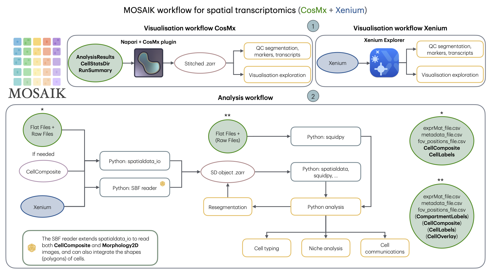

Workflow
=======

The MOSAIK workflow is divided into two main parts:

- **Visualisation component** - enables quality assessment of the immunofluorescence staining and verification of cell segmentation

- **Data integration component** - optimises quality control and downstream analysis

1.  For **visualisation**, MOSAIK employs two strategies: Napari with the CosMx plugin for CosMx data and  Xenium Explorer for Xenium data.

2. For **integration**, MOSAIK converts the raw data into a Python object, faciliating quality control and facilitate downstream analysis.

By separating visualisation from integration, MOSAIK ensures flexibility: users can quickly assess data quality while also preparing it for deeper multimodal exploration.

